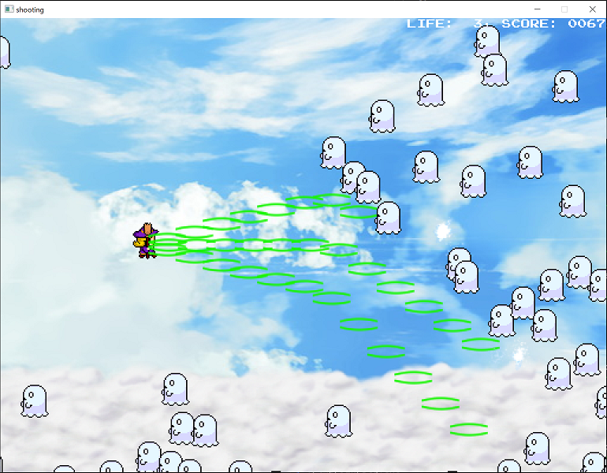

# Shooting Game

This is a side scrolling shoot 'em up game running on Windows 10.
It is written in [Go][] and with [Ebiten][] game library.

This is just in development. (Maybe forever.)

[Ebiten]: https://ebiten.org/
[Go]: https://golang.org/

## Usage

### How to get

1. Download the `stg-<VERSION>.zip` file from [the latest release page](https://github.com/masa213f/shooting-game/releases/latest).
2. Unzip the downloaded file.

### Controls

- arrow keys : Move
- `z` : Shoot / OK
- `x` : Bomb / Cancel (Back)
- space : pause

### Screenshot



## Development

### Preparation

NOTE: This program is developed on Ubuntu 20.04 on WSL2. If you build in another environment, you may get an error.

Install build tools on your Ubuntu.

- Install Git. (Any version is okay)
- Install Go v1.16.xx.

Checkout this repository.

```bash
$ cd ${GOPATH}/src/github.com/masa213f/
$ git clone git@github.com:masa213f/shooting-game.git
$ cd shooting-game
$ make setup
```

### Build and Run

```bash
$ make build
$ make run
```

### Release

```bash
$ VERSION=x.y.z
$ git checkout main
$ git pull
$ git tag -a -m "Release v$VERSION" "v$VERSION"
$ git push origin "v$VERSION"
```

## Special thanks

This program uses some resources published from the following sites.

- Images: [ぴぽや倉庫](https://pipoya.net/sozai/)
- BGM: [魔王魂](https://maoudamashii.jokersounds.com/)
- SE: [無料効果音で遊ぼう！](https://taira-komori.jpn.org/)
